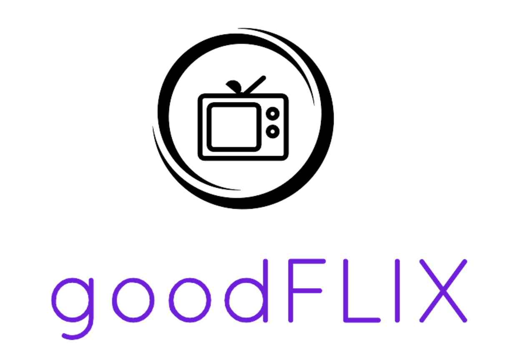

#GoodFlix

###Description:
Goodflix is a movie review and ratings web app with a social feature. It does not provide content, only a platform for leaving reviews and ratings for movies, with a newsfeed so that you can see what ratings and reviews your friends have left.

###Tech:
Goodflix uses Ruby on Rails with a PostgreSQL database. Front end tasks are written in raw JavaScript with jQuery and Bootstrap.

###Team Members:
Jim O'Neal - Chief, Cook, and Bottle Washer
